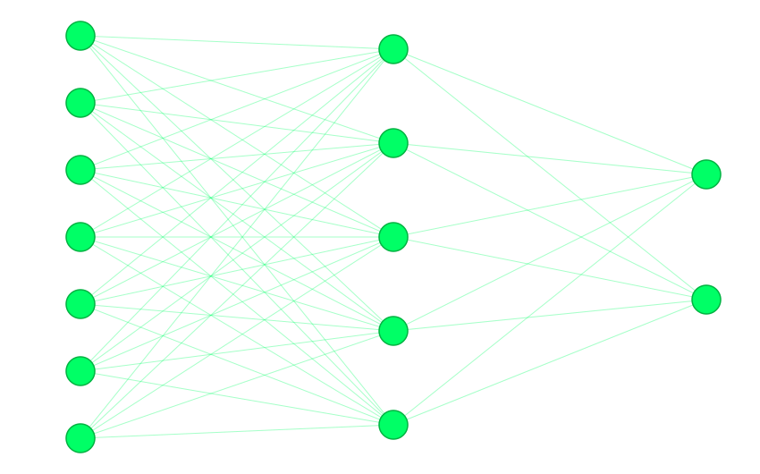

# Artificial Life

An evolutionary artificial-life simulation built with Python and Pygame.

Organisms live in a 2D world, search for food, manage their energy, and evolve over generations. Their behavior is controlled by neural networks whose weights and physical traits mutate between generations.


## How it works

Each organism has:

* Energy
* Age
* Speed
* Vision
* Radius
* Turning ability
* A neural network

The neural network receives information about the organism's environment and produces movement decisions.

Organisms that survive longer and find more food have higher fitness and are more likely to contribute to the next generation.

## Evolution

Physical traits and neural-network parameters mutate between generations.

The current fitness function rewards both finding food and surviving:

```python
fitness = food_eaten * 10 + min(age, 500) / 100
```

The goal is not to explicitly program the organisms to find food, but to create conditions where useful behavior can **emerge through evolution**.

## Experiments

The simulation records each generation to CSV so changes in fitness, speed, vision, age, and food consumption can be analyzed over time.

Some behaviors that have emerged or are currently being investigated include:

* Food-seeking
* Energy conservation
* Movement strategies
* Searching when food is not visible
* Evolution of physical traits

## Running

```bash
pip install pygame
python main.py
```

## Neural Network

Each organism has a neural network that receives environmental
information and produces movement decisions.



## Project Status

This is an ongoing experiment. The simulation and evolutionary system are still being developed and tested.
