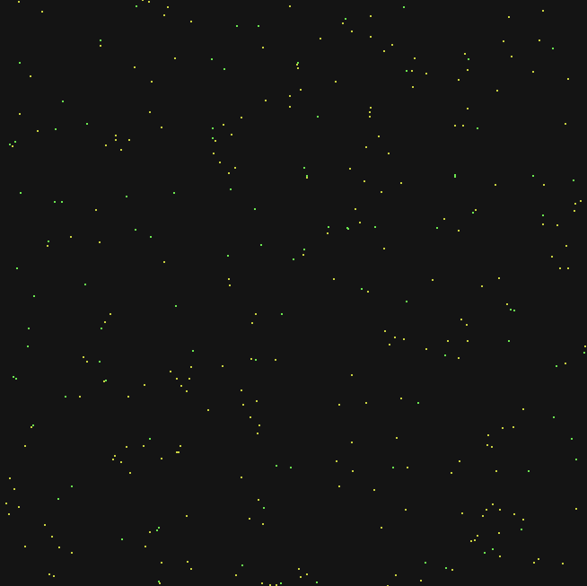

# Artificial Life

An evolutionary artificial life simulation built with Python and Pygame.

The Organisms live in a 2D world, search for food, manage their energy, and evolve over generations. Their behavior is controlled by neural networks whose weights and physical traits mutate between generations.

This project started as a way for me to learn about neural networks, so expect some rough mistakes. Feedback on the network architecture, mutation logic, or fitness function are very welcome.



## Getting Started

### Requirements
- Python 3.x
- Pygame

### Installation

Clone the repo and install dependencies:

```bash
git clone https://github.com/your-username/artificial-life.git
cd artificial-life
pip install -r requirements.txt
```

### Running the simulation

```bash
python main.py
```

## How it works

Each organism has:
* Energy
* Age
* Speed
* Vision
* Radius
* Turning ability
* A neural network

The neural network receives information about the organism's environment and produces movement decisions.

Organisms that survive longer and find more food have higher fitness and are more likely to contribute to the next generation.

## Evolution

Physical traits and neural-network parameters mutate between generations.

The current fitness function rewards both finding food and surviving:

```python
fitness = food_eaten * 10 + min(age, 500) / 100
```

The goal is not to explicitly program the organisms to find food, but to create conditions where useful behavior can **emerge through evolution**.

## Experiments

The simulation records each generation to CSV so changes in fitness, speed, vision, age, and food consumption can be analyzed over time.

Some behaviors that have emerged:
* Food-seeking
* Energy conservation
* Movement strategies
* Searching when food is not visible
* Evolution of physical traits

## Neural Network

Each organism has a small neural network that receives information about its environment and produces movement decisions.

### Inputs
* Energy
* Food detected
* Distance to food
* Direction to food
* Time since food was detected
* Exploration signal from an Ornstein-Uhlenbeck process

### Outputs
* Turn
* Movement


## Project Status

This is an ongoing experiment. The simulation and evolutionary system are still being developed and tested.
